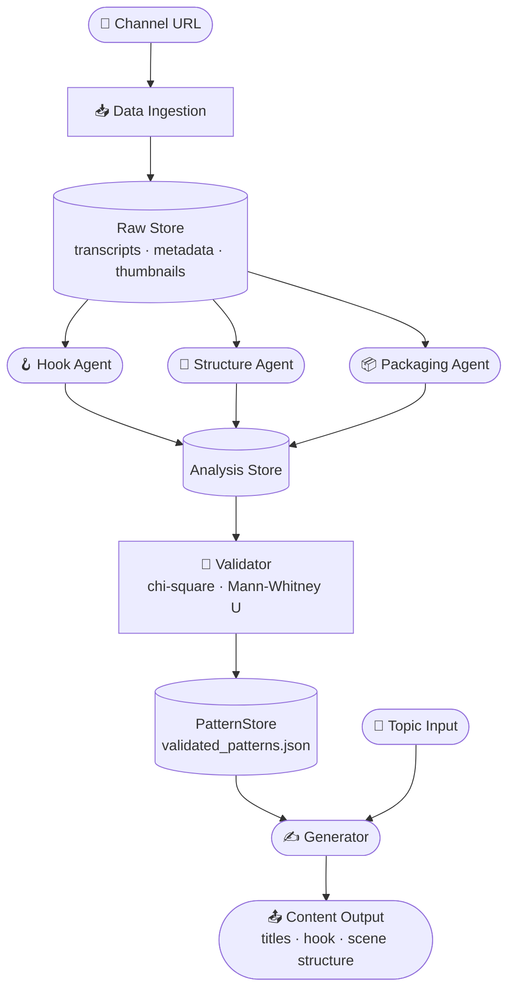

# Viral Signal

> An agentic pipeline that extracts the statistical DNA of top YouTube channels and uses it to generate new content.

---

## The Insight

Most YouTube "automation" tools wrap a prompt around GPT and call it strategy.

This is different.

A channel with 200 videos is a dataset. Every hook, every narrative beat, every packaging decision is a data point. If you treat it like one — extract features, run statistics, find what actually correlates with performance — the patterns stop being opinions.

Viral Signal treats top-performing content as raw data, runs three specialized agents to extract measurable features, validates them statistically against view metrics, and only then uses them to generate new content.

No vibes. Statistically significant patterns or nothing.

**Why bet on AI for this at all?** Because AI's single best feature is mimicry — the ability to reproduce a pattern once that pattern is made explicit. Hand it the statistical DNA of the top 3 creators in the niche you're building toward, and it can climb very high, reaching extreme performance. Theoretically, though, it never exceeds the ceiling set by the humans it learned from — it compresses what they do, it doesn't surpass it.

---

## Pipeline



---

## Event Log

Events emitted during a full pipeline run.

| Event | Trigger | Produces |
|---|---|---|
| `channel.indexed` | Channel URL resolved | Video ID list + basic metadata |
| `video.ingested` | Per video processed | Transcript + stats JSON in Raw Store |
| `hook.analyzed` | Hook Agent completes | Hook type, intensity score, pacing |
| `structure.mapped` | Structure Agent completes | Beat timestamps, pacing ratio, tension curve |
| `packaging.decoded` | Packaging Agent completes | Curiosity gap type, emotional trigger, title structure |
| `pattern.tested` | Validator runs feature | p-value + effect size per feature |
| `pattern.locked` | p < 0.05 threshold met | Entry written to PatternStore |
| `content.generated` | Generator receives topic | Titles, hook script, scene outline |

---

## Agents

### 🪝 Hook Agent

Analyses the first 30 seconds of each transcript.

| Skill | Output |
|---|---|
| Hook type classification | `question` · `shock` · `promise` · `story` · `social proof` |
| Emotional intensity scoring | Float 0–10 |
| Word-level pacing analysis | Words per second before first tonal shift |
| Opening entity extraction | First verb, first number, first named entity |

---

### 📐 Structure Agent

Maps the full narrative arc of the transcript.

| Skill | Output |
|---|---|
| Conflict introduction timing | % into transcript where stakes are first raised |
| Re-engagement beat counting | Number of reward/problem resets mid-video |
| Pacing ratio | WPM in first third vs last third |
| Tension curve classification | `escalating` · `rollercoaster` · `flat` · `cold-open` |

---

### 📦 Packaging Agent

Analyses title and thumbnail together as a single unit.

| Skill | Output |
|---|---|
| Curiosity gap detection | `knowledge-gap` · `outcome-withhold` · `identity-challenge` |
| Emotional trigger classification | `fear` · `greed` · `awe` · `humor` · `anger` |
| Title structure parsing | Word count, numbers present, question mark, brackets |
| Thumbnail element description | Visual elements via local vision model |

---

### 🔬 Validator

Pure statistics. No LLM inference. Takes agent output across the full video dataset and tests each feature for real correlation with performance.

| Method | Applied To |
|---|---|
| Top/bottom quartile split | Views per day since publish |
| Chi-square test | Categorical features (hook type, trigger, gap type) |
| Mann-Whitney U test | Numeric features (intensity score, pacing ratio, beat count) |
| Effect size (Cramér's V / Cohen's d) | All significant features |
| Threshold | p < 0.05 to enter PatternStore |

---

### ✍️ Generator

Receives a topic and reads the PatternStore. Produces content structured around statistically validated patterns only — not generic best practices.

| Skill | Output |
|---|---|
| Title generation | 3 options, each following a different validated packaging pattern |
| Hook scripting | 30-second open following the dominant validated hook type |
| Scene outline | 5–7 scenes timed around validated narrative beat positions |
| Format enforcement | Pydantic output schemas; nothing leaves the generator malformed |

---

## Phases

```
Phase 1 · Ingestion      Collect transcripts, metadata, thumbnails for N videos
Phase 2 · Analysis       Run Hook, Structure, and Packaging agents across all videos
Phase 3 · Validation     Statistical extraction — lock patterns that actually predict performance
Phase 4 · Generation     Topic in. Pattern-constrained content out.
```

---

## Stack

| Layer | Tool |
|---|---|
| Data collection | yt-dlp · youtube-transcript-api |
| Agent inference | Ollama, self-hosted on rented GPU compute |
| Data models | Pydantic v2 |
| Statistical validation | pandas · scipy |
| Orchestration | Python — plain agent loops, no framework overhead |
| Storage | JSON store on rented cloud server storage |

---

*The pipeline runs entirely on rented infrastructure — dedicated server storage and GPU compute powering large-scale AI data training and inference. Self-hosted models, no third-party inference APIs, no per-token cost.*
